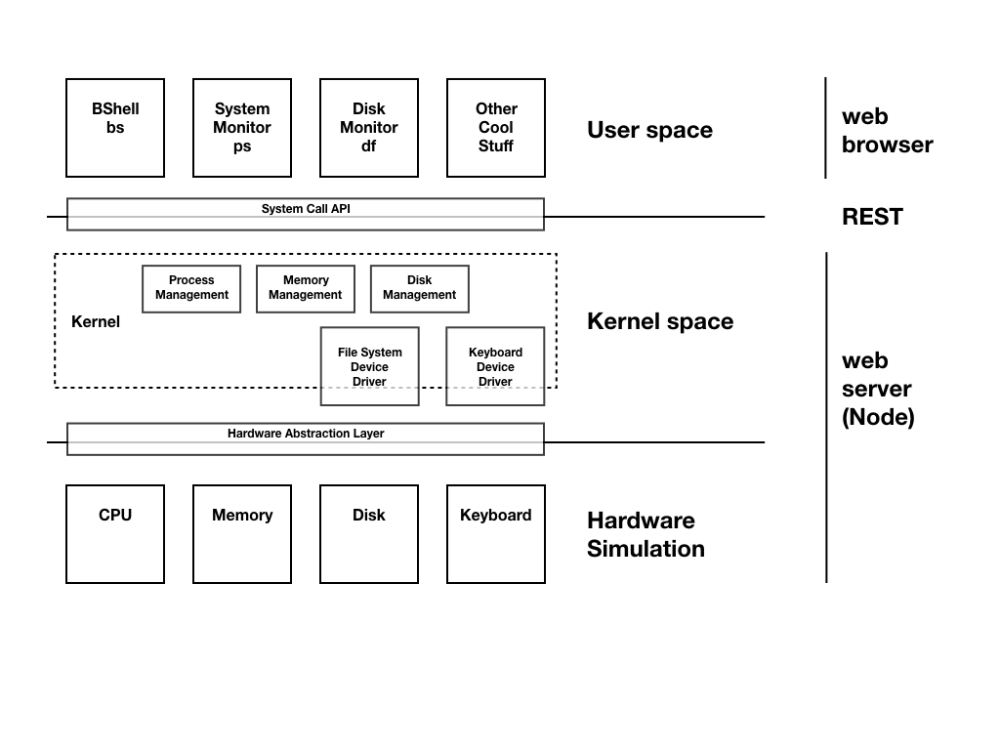

# tsiram-OS
Documentation is still under construction...  Mostly just notes right now as I go through this so I do not forget later.

It needed a name and I like WebOS but I do not like talking to Lawyers.  Tsiram is something I bought the .dot com for a while ago and have not gotten around to using it. If it makes no sense try reading it backwards. I wonder if the lawyers will come anyway...  Regardless this a good name until something better comes along.  Maybe SObeW instead?

## Introduction
Welcome.  This software is an evolution (not revolution) of [Dr. Alan Labouseur's](http://labouseur.com/courses/os/) Operating Systems course project.
- 2019 version: https://github.com/AlanClasses/TSOS-2019
- 2015-2018 version: https://github.com/AlanClasses/TSOS

The major change is that it is re-imagined to divide kernel and user space using a client server web architecture.  All hardware emulation and kernel code exists within a node server application and any applications in userspace (including the shell) are client side.  The medium is a RESTful API that represents a traditional operating systems System Call API.

Here is a cool architecture diagram:

If you already have Node.js and TypeScript installed you can clone this repository, you will likely also have to install the type definitions for node to make TypeScript happy.  Once you do that, see the 'How to run' section of this doc.

If you do not have Node.js and TypeScript installed see the 'Installation' section below.

## Installation
### Node:
**Mac**
1. Recommend installation with homebrew: `brew install node`
2. You can use the following to download and run a pkg file:

`curl "https://nodejs.org/dist/latest/node-${VERSION:-$(wget -qO- https://nodejs.org/dist/latest/ | sed -nE 's|.*>node-(.*)\.pkg</a>.*|\1|p')}.pkg" > "$HOME/Downloads/node-latest.pkg" && sudo installer -store -pkg "$HOME/Downloads/node-latest.pkg" -target "/"`

**Windows:** There is a installer to download from Node.js website

Node getting started: https://nodejs.org/en/docs/guides/getting-started-guide/

I particularly like this resource as well: https://developer.mozilla.org/en-US/docs/Learn/Server-side/Express_Nodejs/development_environment

### TypeScript:
Documentation: https://www.typescriptlang.org/docs/home.html

Installing TypeScript: https://www.typescriptlang.org/docs/handbook/typescript-in-5-minutes.html
`npm install -g typescript`

### @types/node
Type definitions to be used for Node.js. This should be installed when you run `npm install` to install dependencies.
See : https://www.npmjs.com/package/@types/node
`npm install @types/node --save-dev`

## How to run
First run `npm install` to install node dependencies

Next, TypeScript must be compiled before you can run and after you make changes to TypeScript (.ts) files.  There is a provided bash script called 'c' in the project root.  You may need to add execute permission to the file before you can run.  

Once you run it, you should see that a dist/ folder is created in your project home and it contains the JavaScript that your Node.js server will run.

To start the node server run `npm start` that's it!

Once you have your project going, you should be able to recompile using the 'c' bash script and then 'npm start' to run node.
